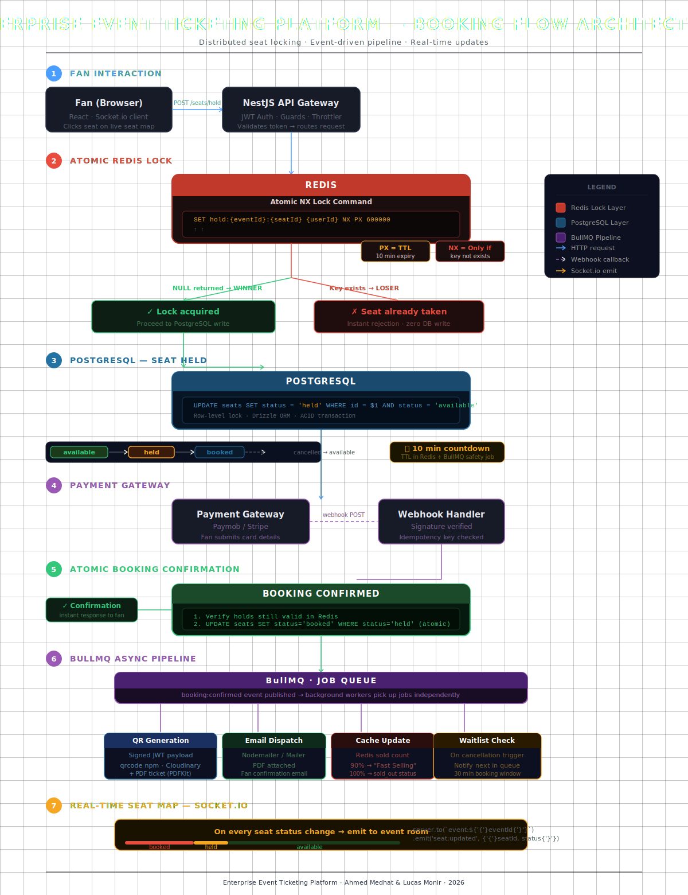
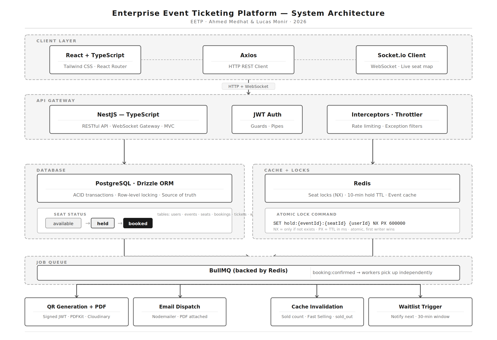

# Enterprise Event Ticketing Platform (EETP)

> Developed by **Ahmed Medhat** & **Lucas Monir**

<div align="center">
  
</div>

---

## Project Overview

**Enterprise Event Ticketing Platform (EETP)** is a production-grade, full-stack event ticketing platform engineered to handle high-concurrency seat selection under extreme load. Think of it as a mini Ticketmaster — event organizers publish events with custom seating maps and pricing tiers, fans browse and purchase tickets, and the platform handles the hard engineering problem: thousands of users targeting the same seat at the same second.

The core architecture is built around **distributed Redis locking**, **time-bounded seat reservations**, and an **event-driven async pipeline** — ensuring zero double-bookings, instant payment confirmation, and real-time seat map updates across all connected clients.

**Developed by:** Ahmed Medhat & Lucas Monir
**Project Type:** Full‑Stack Web Application — Monolithic Architecture
**License:** Proprietary – All rights reserved

---

# Application System Design

## The Hard Problem
Picture this: a famous band announces a concert. Tickets go on sale at 8PM. At exactly 8PM, 10,000 people hit the booking page simultaneously. There are only 500 seats.
Built wrong, two people book the same seat. Someone pays and gets told the seat is gone. The site crashes.
The entire backend architecture exists to solve this one problem. Everything else is standard CRUD.

**Solution:**
## EETP - Booking Flow Architect

*EETP - Booking Flow Architect*

---

## System Architecture
## EETP - System Architecture

*EETP - System Architecture*

---

## Key Technical Decisions

| Problem | Solution | Why |
|---|---|---|
| Concurrent seat selection | `SET hold:{eventId}:{seatId} {userId} NX PX 600000` | Redis atomic NX — only one writer wins, no DB write for loser |
| Seat hold expiry | Redis TTL + BullMQ delayed job safety net | Defense in depth — Redis expiry isn't instant |
| Booking confirmation latency | BullMQ async pipeline | Fan's response time never depends on email server speed |
| Real-time seat map | Socket.io event rooms | Every seat status change broadcasts instantly to all viewers |
| Ticket forgery | Signed JWT encoded in QR | Signature verified at door scan — IDs alone are forgeable |
| Cache stampede on listings | Redis cache + event-driven invalidation | High-read, low-write — invalidate on organizer update only |

---

## Tech Stack

### Backend
| Technology | Purpose | Version |
|---|---|---|
|  | Backend Framework | 10.x |
|  | Language | 5.x |
|  | Primary Database | 16.x |
|  | Locks, Cache, Queue Backend | 7.x |
|  | Job Queue | 5.x |
|  | Real-time WebSocket | 4.x |
|  | PostgreSQL ORM | Latest |
|  | Auth + Ticket Signing | 9.x |
|  | Containerization | Latest |

### Frontend
| Technology | Purpose | Version |
|---|---|---|
|  | UI Library | 18.x |
|  | Language | 5.x |
|  | Styling | 3.x |
|  | Client-side Routing | 6.x |
|  | HTTP Client | 1.x |
|  | Icons | 7.x |

---

## Project Structure

### Root
```js
enterprise-event-ticketing-platform/
├── client/
├── server/
├── database/
├── public/
├── docker-compose.yml
└── README.md
```

### Backend (NestJS + PostgreSQL)
```js
server/
├── src/
│   ├── database/
│   │   ├── database.module.ts
│   │   └── schema.ts
│   ├── app.controller.ts
│   ├── app.module.ts
│   ├── app.service.ts
│   └── main.ts
│
├── test/
├── .env.example
├── .gitignore
├── .prettierrc
├── drizzle.config.ts
├── eslint.config.mjs
├── nest-cli.json
├── package-lock.json
├── package.json
├── README.md
├── tsconfig.build.json
└── tsconfig.json
```

### Frontend (React + TypeScript)
```js
client/
├── public/
├── src/
│   ├── app/
│   │   ├── components/
│   │   │   ├── common/
│   │   │   │   ├── Navbar.tsx
│   │   │   │   ├── Footer.tsx
│   │   │   │   ├── LoadingSpinner.tsx
│   │   │   │   └── ProtectedRoute.tsx
│   │   │   ├── events/
│   │   │   │   ├── EventCard.tsx
│   │   │   │   ├── EventFilters.tsx
│   │   │   │   └── EventBadge.tsx
│   │   │   ├── seat-map/
│   │   │   │   ├── SeatMap.tsx
│   │   │   │   ├── Seat.tsx
│   │   │   │   └── SeatLegend.tsx
│   │   │   ├── checkout/
│   │   │   │   ├── CheckoutForm.tsx
│   │   │   │   ├── HoldTimer.tsx
│   │   │   │   └── OrderSummary.tsx
│   │   │   └── organizer/
│   │   │       ├── EventForm.tsx
│   │   │       ├── SeatingBuilder.tsx
│   │   │       └── SalesChart.tsx
│   │   ├── pages/
│   │   │   ├── guest/
│   │   │   │   ├── HomePage.tsx
│   │   │   │   └── EventDetailPage.tsx
│   │   │   ├── auth/
│   │   │   │   ├── LoginPage.tsx
│   │   │   │   └── RegisterPage.tsx
│   │   │   ├── fan/
│   │   │   │   ├── SeatSelectionPage.tsx
│   │   │   │   ├── CheckoutPage.tsx
│   │   │   │   ├── BookingConfirmationPage.tsx
│   │   │   │   └── MyBookingsPage.tsx
│   │   │   ├── organizer/
│   │   │   │   ├── OrganizerDashboardPage.tsx
│   │   │   │   ├── CreateEventPage.tsx
│   │   │   │   └── CheckInPage.tsx
│   │   │   └── admin/
│   │   │       └── AdminDashboardPage.tsx
│   │   ├── layouts/
│   │   │   ├── MainLayout.tsx
│   │   │   └── DashboardLayout.tsx
│   │   └── guards/
│   │       ├── GuestGuard.tsx
│   │       └── RoleGuard.tsx
│   ├── hooks/
│   │   ├── useAuth.ts
│   │   ├── useSeatMap.ts
│   │   └── useSocket.ts
│   ├── services/
│   │   ├── auth.service.ts
│   │   ├── events.service.ts
│   │   ├── seats.service.ts
│   │   ├── bookings.service.ts
│   │   └── tickets.service.ts
│   ├── store/
│   │   ├── auth.store.ts
│   │   └── checkout.store.ts
│   ├── types/
│   │   ├── event.types.ts
│   │   ├── seat.types.ts
│   │   ├── booking.types.ts
│   │   └── user.types.ts
│   ├── config/
│   │   └── axios.ts
│   ├── App.tsx
│   ├── main.tsx
│   └── index.css
├── .env.example
├── .gitignore
├── tailwind.config.js
├── vite.config.ts
├── tsconfig.json
├── package.json
└── Dockerfile
```

---

## Database Design (ERD Overview)

### Core Tables
**users** — `id`, `name`, `email`, `password_hash`, `role` (fan | organizer | admin), `created_at`

**events** — `id`, `organizer_id`, `title`, `description`, `venue`, `city`, `category`, `date`, `banner_url`, `type` (seated | general_admission), `capacity`, `status` (draft | published | on_sale | sold_out | completed | cancelled), `refund_policy`, `created_at`

**pricing_tiers** — `id`, `event_id`, `name`, `price`, `early_bird_expires_at`

**seats** — `id`, `event_id`, `tier_id`, `row`, `number`, `status` (available | held | booked), `created_at`
> ⚠️ `status` is the most critical field in the system — all locking logic protects this column.

**bookings** — `id`, `fan_id`, `event_id`, `total_amount`, `platform_fee`, `status` (pending | confirmed | cancelled), `created_at`

**booking_seats** — `id`, `booking_id`, `seat_id`

**tickets** — `id`, `booking_id`, `seat_id`, `fan_id`, `qr_payload` (signed JWT), `checked_in`, `checked_in_at`, `pdf_url`

**waitlist** — `id`, `fan_id`, `event_id`, `position`, `notified_at`, `window_expires_at`, `created_at`

---

### Event Seat Statuses
```
available → held (fan clicks) → booked (payment confirmed)
held → available (10 min TTL expires or payment fails)
booked → available (cancellation, triggers waitlist)
```

### Event Lifecycle
```
draft → published → on_sale → sold_out → completed
                                       → cancelled
```

### Async Post-Booking Pipeline (BullMQ)
1. Generate signed JWT QR code per ticket
2. Render PDF ticket with seat info
3. Send confirmation email with PDF attached
4. Update sold count in Redis cache
5. Check if event crossed 90% capacity — update badge
6. Check if event is sold out — update status, notify organizer
7. Trigger waitlist if cancelled booking

### Real-time Seat Map
Every seat status change emits a Socket.io event to the event room:
```typescript
this.server.to(`event:${eventId}`).emit('seat:updated', {
  seatId,
  status: 'held' | 'booked' | 'available'
});
```
All fans viewing the seat map see updates live without refreshing.

### QR Ticket Verification
Tickets encode a **signed JWT**, not just a ticket ID. Organizer scans at the door → API verifies signature, checks not already scanned, marks `checked_in`.

---

## Installation

### Prerequisites
- Node.js 20+
- Docker & Docker Compose
- Git

### Quick Start (Docker)
```bash
git clone https://github.com/ahmedmedhat-se/enterprise-event-ticketing-platform.git
cd enterprise-event-ticketing-platform
cp server/.env.example server/.env
cp client/.env.example client/.env
docker-compose up --build
```

### Backend Setup (Manual)
```bash
cd server
npm install
```

**Install core dependencies:**
```bash
npm install @nestjs/common @nestjs/core @nestjs/platform-express @nestjs/platform-socket.io
npm install @nestjs/websockets socket.io
npm install @nestjs/jwt @nestjs/passport passport passport-jwt
npm install @nestjs/config @nestjs/throttler
npm install drizzle-orm postgres
npm install ioredis bullmq @nestjs/bullmq
npm install class-validator class-transformer
npm install bcrypt jsonwebtoken
npm install qrcode pdfkit
npm install nodemailer @nestjs-modules/mailer
npm install @types/multer multer
```

**Install dev dependencies:**
```bash
npm install -D @types/node @types/bcrypt @types/qrcode @types/pdfkit
npm install -D drizzle-kit typescript ts-node
npm install -D @nestjs/testing jest ts-jest
```

**Run migrations and start:**
```bash
npm run db:generate
npm run db:migrate
npm run start:dev
```

### Frontend Setup (Manual)
```bash
cd client
npm install
```

**Install dependencies:**
```bash
npm install react react-dom react-router-dom
npm install axios socket.io-client
npm install @fortawesome/fontawesome-svg-core
npm install @fortawesome/free-solid-svg-icons
npm install @fortawesome/free-regular-svg-icons
npm install @fortawesome/free-brands-svg-icons
npm install @fortawesome/react-fontawesome
npm install -D tailwindcss postcss autoprefixer
npm install -D typescript @types/react @types/react-dom vite @vitejs/plugin-react
```

```bash
npm run dev
```

---

## API Documentation

### Base URL
```
http://localhost:PORT/api/v1/
```

### Authentication API
```
POST   /auth/register
POST   /auth/login
GET    /auth/me
POST   /auth/logout
PUT    /auth/profile
PUT    /auth/change-password
```

### Events API
```
GET    /events                     — Browse events (cached)
GET    /events/:id                 — Event detail
POST   /events                     — Create event (organizer)
PUT    /events/:id                 — Update event (organizer)
DELETE /events/:id                 — Cancel event (organizer)
GET    /events/:id/seats           — Seat map
```

### Seats API
```
POST   /seats/:id/hold             — Hold seat (Redis NX lock)
DELETE /seats/:id/hold             — Release hold
```

### Bookings API
```
POST   /bookings                   — Create booking (post-payment)
GET    /bookings                   — Fan booking history
GET    /bookings/:id               — Booking detail
DELETE /bookings/:id               — Cancel booking
```

### Tickets API
```
GET    /tickets/:id                — Ticket detail
GET    /tickets/:id/pdf            — Download PDF
POST   /tickets/:id/verify         — Verify QR at door (organizer)
```

### Payments API
```
POST   /payments/initiate          — Start payment session
POST   /payments/webhook           — Payment gateway webhook
```

### Waitlist API
```
POST   /waitlist/:eventId          — Join waitlist
DELETE /waitlist/:eventId          — Leave waitlist
```

### Organizer API
```
GET    /organizer/dashboard        — Sales overview
GET    /organizer/events           — Organizer's events
GET    /organizer/events/:id/stats — Event analytics
GET    /organizer/checkin/:eventId — Check-in screen
```

### Admin API
```
GET    /admin/stats                — Platform revenue & stats
GET    /admin/organizers           — Pending organizer approvals
PUT    /admin/organizers/:id       — Approve/reject organizer
GET    /admin/users                — All users
DELETE /admin/users/:id            — Remove user
```

### WebSocket Events
```
Client → Server:
  join:event     { eventId }        — Subscribe to seat map updates
  leave:event    { eventId }        — Unsubscribe

Server → Client:
  seat:updated   { seatId, status } — Seat status changed
  event:soldout  { eventId }        — Event just sold out
```

---

## Docker Compose


---

## License

**PROPRIETARY LICENSE**
© 2026 Ahmed Medhat & Lucas Monir. All Rights Reserved.

This project is a personal, non-commercial work created solely to demonstrate full-stack engineering skills at a production level.

This software and associated documentation are proprietary and confidential. No part of this project may be reproduced, distributed, or transmitted in any form without prior written permission from the authors.

---

## Authors

- **Ahmed Medhat - Lucas Monir** — Backend Architecture, Database Design, Real-time Systems, Frontend Development, UI/UX Design